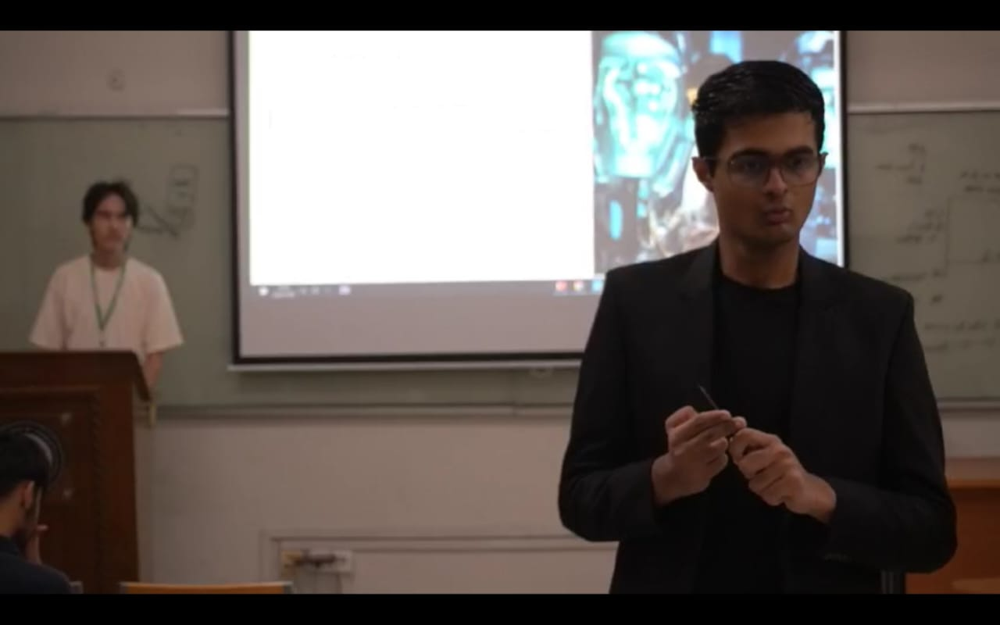

> [!CAUTION]
> Github commit activity should never be used to judge anyone! If you are surfing through my profile to evaluate me, please judge the content itself.

  

Me at a workshop on Medical innovations from AI

Greetings!
---------

I am currently studying at [Beaconhouse International College](https://bic.edu.pk/) and focusing on a prospective
degree in Data Science. My primary interests are individually studying about bug-bounty, studying rigor Mathematical
Analysis, and working on introspecting life and its philosophy to a certain consensus.

 - 🤎 I am brown and I want to empower brown people
 - 📖 I casually write books
 - 🐞 I love bugs

You may access my academic work at [OnJo](https://aitzazimtiaz.github.io/onjo/), including disemmination of my academic work to public at large.

---

> [!NOTE]
> This page will be subjected to a future over-haul.
